# terraform-eks-platform

Production-grade, multi-environment Amazon EKS infrastructure managed with Terraform.

## Architecture

<p align="center">
  
</p>

## Features

- **Multi-environment EKS clusters** -- separate stacks for dev, mgmt, and production across regions
- **Reusable Terraform modules** -- shared EKS module with per-environment configuration
- **IAM Roles for Service Accounts (IRSA)** -- fine-grained pod-level IAM permissions
- **Cluster add-ons** -- NGINX Ingress, ExternalDNS, Cluster Autoscaler pre-configured
- **Remote state management** -- S3 backend with per-environment state isolation
- **Auto-scaling worker nodes** -- configurable min/max/desired capacity per environment
- **Multi-region support** -- us-east-1 and eu-west-1 deployments
- **Security-first** -- custom security groups, private subnets, SSH key management

## Prerequisites

- [Terraform](https://www.terraform.io/downloads) >= 1.0
- [AWS CLI](https://aws.amazon.com/cli/) v2 configured with appropriate credentials
- [kubectl](https://kubernetes.io/docs/tasks/tools/) for cluster access
- [Helm](https://helm.sh/) v3 for add-on deployment
- [terraform-docs](https://terraform-docs.io/) (optional, for generating module docs)
- [tflint](https://github.com/terraform-linters/tflint) (optional, for linting)
- [checkov](https://www.checkov.io/) (optional, for security scanning)

## Directory Structure

```
.
├── Makefile                          # Common terraform commands
├── Jenkinsfile                       # CI/CD pipeline definition
├── modules/
│   └── aws_eks/                      # Reusable EKS module
│       ├── main.tf                   # EKS cluster, security groups, node groups
│       ├── variables.tf              # Input variables
│       ├── versions.tf               # Terraform and provider version constraints
│       ├── datasources.tf            # VPC, subnet, and identity data sources
│       ├── iam.tf                    # Worker node IAM roles and policies
│       ├── iam-clusterautoscaler.tf  # Cluster Autoscaler IAM role
│       ├── iam-external-dns.tf       # ExternalDNS IAM role
│       ├── iam-workflow.tf           # Workflow service IAM role
│       ├── ssh_key.tf                # EC2 key pair for SSH access
│       └── keys/                     # SSH public keys per environment
├── stacks/                           # Per-environment configurations
│   ├── dev-npe/                      # Development non-production
│   ├── mgmt-npe/                     # Management non-production
│   ├── mgmt-ri/                      # Management RI environment
│   └── mgmt-euw1-pe/                 # Management production (eu-west-1)
├── environments/
│   └── mgmt/HelmValuesNPE/           # Helm values for cluster add-ons
└── helmfile/                         # Helmfile-based bootstrap scripts
```

## Usage

### 1. Initialize a stack

```bash
# Using make
make init STACK=dev-npe

# Or directly
cd stacks/dev-npe
terraform init
```

### 2. Plan changes

```bash
make plan STACK=dev-npe
```

### 3. Apply changes

```bash
make apply STACK=dev-npe
```

### 4. Deploy cluster add-ons

After the EKS cluster is provisioned, deploy add-ons using the Helm scripts in each stack directory:

```bash
cd stacks/dev-npe
./helm.sh
```

### 5. Connect to the cluster

```bash
aws eks update-kubeconfig --name dev-npe --region us-east-1
kubectl get nodes
```

## Available Stacks

| Stack | Region | Purpose |
|-------|--------|---------|
| `dev-npe` | us-east-1 | Development / non-production |
| `mgmt-npe` | us-east-1 | Management / non-production |
| `mgmt-ri` | us-east-1 | Management / RI |
| `mgmt-euw1-pe` | eu-west-1 | Management / production (EU) |

## Cluster Add-ons

Each stack deploys the following Kubernetes add-ons via Helm:

| Add-on | Purpose |
|--------|---------|
| **NGINX Ingress** | L7 load balancing with internal ALB + ACM TLS termination |
| **ExternalDNS** | Automatic Route 53 DNS record management |
| **Cluster Autoscaler** | Node-level auto-scaling based on pod scheduling pressure |
| **Metrics Server** | Resource metrics for HPA and `kubectl top` |

## Customization

### Adding a new environment

1. Copy an existing stack directory:
   ```bash
   cp -r stacks/mgmt-ri stacks/<stack>-<env>
   ```

2. Update `main.tf` locals:
   - `vpc_id` -- target VPC
   - `region` -- AWS region
   - `stack` / `env` -- naming convention
   - `asg_min_size`, `asg_desired_capacity`, `asg_max_size`

3. Update the S3 backend key to a unique path

4. Generate an SSH key pair and place the `.pub` file in `modules/aws_eks/keys/`

5. Update Helm values for add-ons (ingress class, ACM cert ARN, Route 53 zone ID)

### Modifying worker node configuration

Edit the stack's `main.tf` to adjust:

- `worker_node_instance_type` -- EC2 instance type (default: `m5.xlarge`)
- `kubernetes_version` -- EKS version (default: `1.28`)
- `root_volume_size` -- EBS volume size in GB (default: `500`)

## Linting and Validation

```bash
# Format all .tf files
make fmt

# Check formatting without changes
make fmt-check

# Validate configuration
make validate STACK=dev-npe

# Run tflint
make lint STACK=dev-npe

# Run checkov security scan
make security-scan STACK=dev-npe
```

## Contributing

1. Fork the repository
2. Create a feature branch (`git checkout -b feature/my-feature`)
3. Run `make fmt` and `make validate` before committing
4. Commit your changes (`git commit -m 'Add my feature'`)
5. Push to the branch (`git push origin feature/my-feature`)
6. Open a Pull Request

## License

This project is licensed under the MIT License. See the [LICENSE](LICENSE) file for details.
